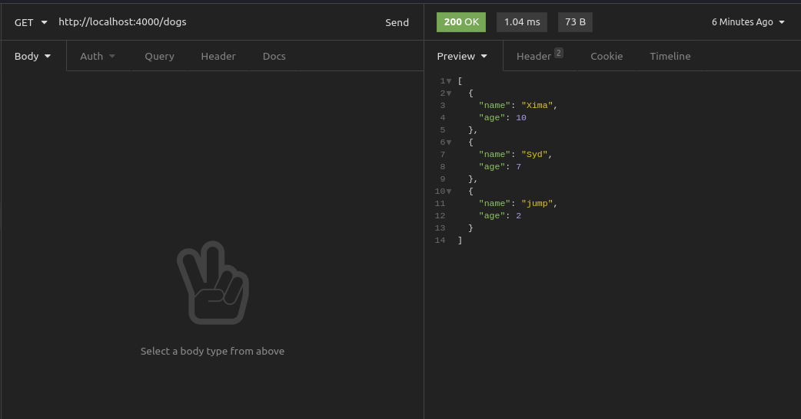
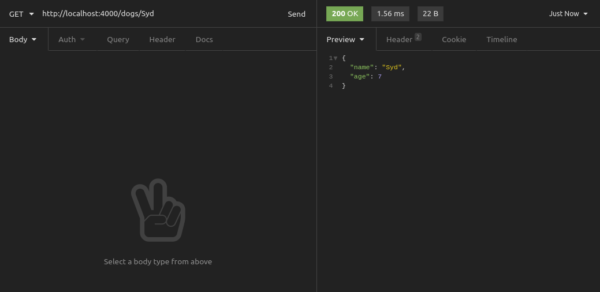
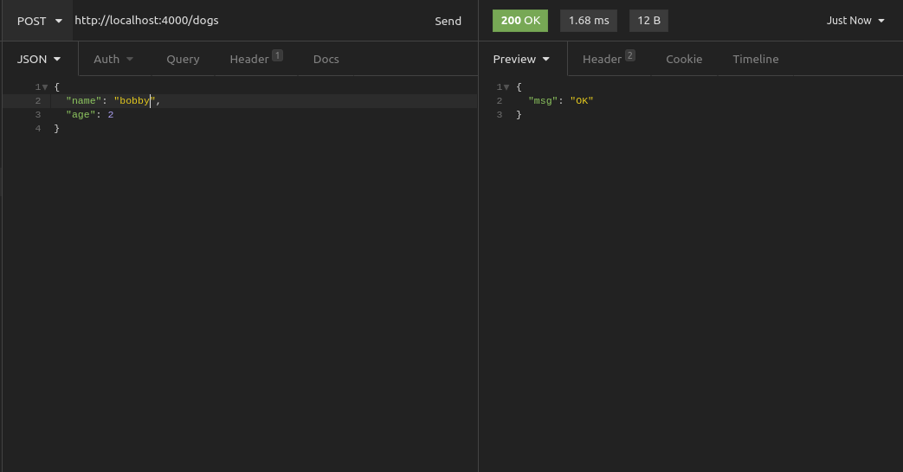
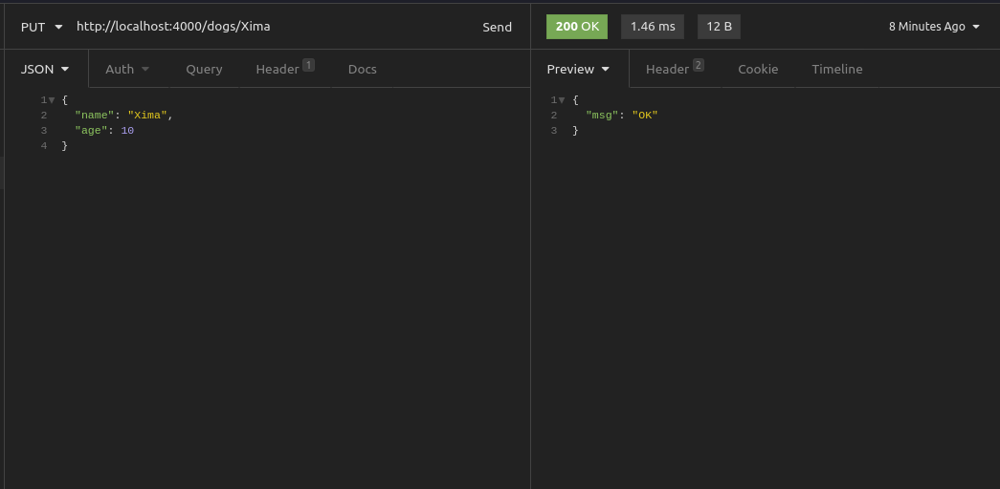
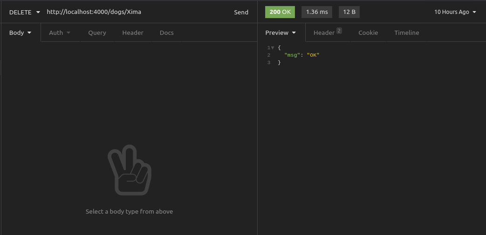

# (Deno) REST API using Oak

**Our server will store, in memory, a list of dogs with name and age.**

 We want to:
 - [] add new dogs
 - [] list dogs
 - [] get details about specific dog
 - [] remove a dog from list
 - [] update a dog's age

**list of all the dogs**


**retrieve a single dog by name**


**add a new dog**


**update a dog’s age**



**remove a dog from our list**


 ## Run
 ```
    deno run --allow-env --allow-net server.ts
 ```
## Links
 [The Deno Handbook: A TypeScript Runtime Tutorial with Code Examples] (https://www.freecodecamp.org/news/the-deno-handbook/)